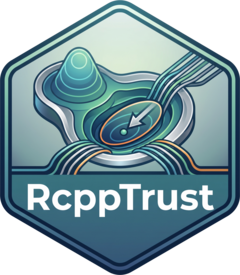

<!-- README.md is generated from README.Rmd. Please edit that file -->

```{r, include = FALSE}
knitr::opts_chunk$set(
  collapse = TRUE,
  comment = "#>",
  fig.path = "man/figures/README-",
  out.width = "100%"
)
```

# RcppTrust 

<!-- badges: start -->
[](https://app.codecov.io/gh/nlmixr2/RcppTrust)
[](https://github.com/nlmixr2/RcppTrust/actions/workflows/R-CMD-check.yaml)
[](https://cran.r-project.org/package=RcppTrust)
[](https://cran.r-project.org/package=RcppTrust)
<!-- badges: end -->

RcppTrust is a thread-safe C++ port of the trust-region optimizer in
Charles J. Geyer's CRAN package [`trust`](https://cran.r-project.org/package=trust),
built for use in [`nlmixr2est`](https://github.com/nlmixr2/nlmixr2est).
It implements the exact same algorithm -- same Newton / easy-easy /
hard-easy / hard-hard trust-region subproblem, same termination
criteria -- and exposes it three ways:

- **`trust()`**, a drop-in R replacement for `trust::trust()`, with the
  same arguments, defaults, and return value.
- **`trust_solve_c()`**, a thread-safe C entry point (a C objective
  function pointer plus a small options struct, no R API calls) safe
  to call from parallel C++ code such as an OpenMP loop.
- A header-only, positionally-indexed function-pointer table
  (`inst/include/RcppTrust.h`), so another package can call
  `trust_solve_c()` without linking against this package's shared
  library -- the same pattern `rxode2`/`n1qn1`/`lbfgsb3c` use across
  the nlmixr2 ecosystem.

It also includes three more trust-region optimizers built the same way,
each with an R function and a thread-safe C entry point:

| R function | Ported from | Needs | C entry point |
|---|---|---|---|
| `steihaug()` | [basin](https://github.com/jolars/basin) (Rust) | gradient + Hessian or Hessian-vector products | `steihaug_solve_c()` |
| `bobyqa()` | Powell's [BOBYQA Fortran](https://github.com/libprima/prima/tree/main/fortran/original/bobyqa), via [`minqa`](https://cran.r-project.org/package=minqa) | function values only; box bounds | `bobyqa_solve_c()` |
| `newuoa()` | Powell's [NEWUOA Fortran](https://github.com/libprima/prima/tree/main/fortran/original/newuoa), via [`minqa`](https://cran.r-project.org/package=minqa) | function values only | `newuoa_solve_c()` |

`bobyqa()`/`newuoa()` are drop-in replacements for their `minqa`
counterparts and give bitwise-identical results; `steihaug()` reproduces
basin's iterates bit for bit. See `vignette("trust-region-methods")`.

See `vignette("RcppTrust")` for what's the same as upstream `trust`,
what's different, and a worked example of the C interface and the
registration pattern.

Note this package was generated with the help of AI (Claude/Gemini).

## Installation

You can install the development version of RcppTrust from
[GitHub](https://github.com/) with:

``` r
# install.packages("pak")
pak::pak("nlmixr2/RcppTrust")
```

## Example

`trust()` is a straight substitute for `trust::trust()`:

```{r example}
library(RcppTrust)

# Rosenbrock's function, the example from ?trust::trust
objfun <- function(x) {
  f <- expression(100 * (x2 - x1^2)^2 + (1 - x1)^2)
  g1 <- D(f, "x1"); g2 <- D(f, "x2")
  h11 <- D(g1, "x1"); h12 <- D(g1, "x2"); h22 <- D(g2, "x2")
  x1 <- x[1]; x2 <- x[2]
  list(
    value = eval(f), gradient = c(eval(g1), eval(g2)),
    hessian = rbind(c(eval(h11), eval(h12)), c(eval(h12), eval(h22)))
  )
}

out <- trust(objfun, c(3, 1), 1, 5)
out[c("value", "argument", "converged", "iterations")]
```

## Authors

- Charles J. Geyer -- original algorithm and R implementation
  (`trust`)
- M. J. D. Powell -- BOBYQA and NEWUOA algorithms and original Fortran 77
  code
- Douglas Bates, Katharine M. Mullen, John C. Nash, Ravi Varadhan --
  `minqa`, the R distribution of Powell's code this port follows
- Johan Larsson and basin contributors -- basin's Steihaug trust-region
  implementation
- Matthew Fidler -- thread-safe C++ ports (`RcppTrust`)
